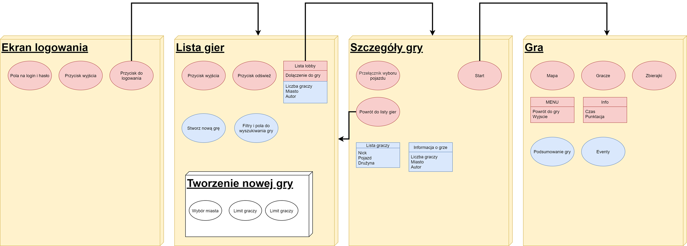

# Frontend

Aplikacja dla klienta została wykonana z użyciem silnika Unity i języka C#, oraz przetestowana pod Windowsem. Klient dostaje folder z plikiem wykonywalnym, który włącza całą aplikację.

Przepływ okien dostepny jest na załączonym diagramie:

Od momentu podłączenia do serwera klient cały czas nasłuchuje wiadomości od serwera za pomocą controllerów - każdy z nich sprawdza czy została wysłana wiadomość z odpowiednim identyfikatorem i podejmuje odpowiednie kroki. Po naciśnięciu kazdego przycisku aplikacja nie przechodzi sama do innych scen. Robi to dopiero po otrzymaniu wiadomości z serwera.

Podczas właściwej gry podserwer wysyła pozycję graczy oraz zbierajek, a aplikacja wyświetla je w odpowiedni sposób. Sterowanie działa przez zaznaczenie myszką - postać idzie tam gdzie się kliknie, po czym się zatrzymuje. Po zakończeniu rozgrywki, gracz wraca do ekranu wyboru pokoju z listy.
