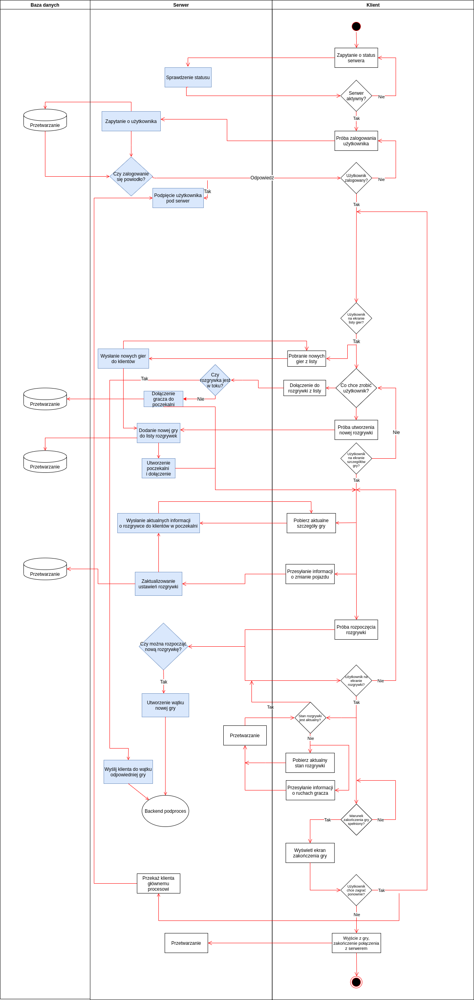

# Główny serwer

* [Komunikacja z innymi komponentami projektu](#komunikacja-z-innymi-komponentami-projektu)
  * [Komunikacja z frontendem](#komunikacja-z-frontendem)
  * [Komunikacja z podprocesem](#komunikacja-z-podprocesem)
  * [Komunikacja z bazą danych](#komunikacja-z-bazą-danych)
* [Kod i stuktura programu](#kod-i-struktura-programu)
* [Instalacja i uruchomienie](#instalacja-i-uruchomienie)

## Komunikacja z innymi komponentami projektu

### Komunikacja z frontendem
Komunikacja z frontendem, czyli wieloma klientami odbywa się za pomocą serwera typu non-blocking poprzez protokół TCP. Synchronizacja non-blocking zapewnia obsługę wielu wątków równocześnie oraz odporność na zakleszczenie.

### Komunikacja z podprocesem

### Komunikacja z bazą danych

## Kod i stuktura programu

## Instalacja i uruchomienie
