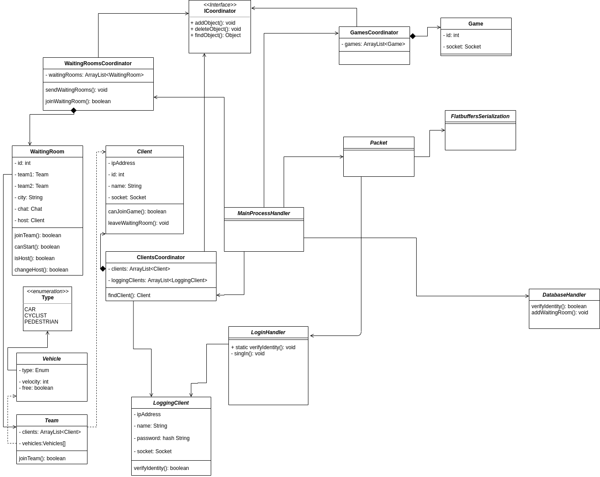

# Główny serwer

* [Komunikacja z innymi komponentami projektu](#komunikacja-z-innymi-komponentami-projektu)
  * [Komunikacja z frontendem](#komunikacja-z-frontendem)
  * [Komunikacja z podprocesem](#komunikacja-z-podprocesem)
  * [Komunikacja z bazą danych](#komunikacja-z-bazą-danych)
* [Kod i stuktura programu](#kod-i-struktura-programu)
* [Instalacja i uruchomienie](#instalacja-i-uruchomienie)

## Komunikacja z innymi komponentami projektu

### Komunikacja z frontendem
Komunikacja z frontendem, czyli wieloma klientami, odbywa się za pomocą serwera typu non-blocking poprzez protokół TCP. Synchronizacja non-blocking zapewnia obsługę wielu wątków równocześnie oraz odporność na zakleszczenie.


### Komunikacja z podprocesem
Komunikacja z podprocesem, czyli wieloma trwającymi rozgrywkami, odbywa się za pomocą serwera typu non-blocking poprzez protokół TCP. Synchronizacja non-blocking zapewnia obsługę wielu wątków równocześnie oraz odporność na zakleszczenie. Serwer uruchamia kolejne rozgrywki oraz obsługuje ich zakończenie i opuszczanie gry przez graczy.

### Komunikacja z bazą danych
Komunikacja z bazą danych odbywa się za pomocą interfejsu JDBC. Z bazy pobierane sa informacje podczas logowania oraz do bazy zapisywane są informacje nt. powstających poczekalni. 

## Kod i struktura programu
Kod został napisany w języku Java z wykorzystaniem narzędzia Maven. 
#### Główne klasy
* Server - serwer komunikujący się z klientem
* GameServer - tworzenie nowych rozgrywek
* DatabaseCoordinator - połączenie z bazą danych
* PacketHandler - tworzenie i rozpakowywanie przesyłanych pakietów
* Serialization - serializacja i deserializacja
* WaitingRoomsCoordinator, ClientsCoordinator, GamesCoordinator - przechowywanie i obsługa danych 



## Instalacja i uruchomienie
Aplikacja została przetestowana pod systemem 18.04.4. Do uruchomienia projektu zalecane jest zainstalowanie zintegrowanego środowiska programistycznego dla Javy np. Intellij lub Eclipse, alternatywnie w konsoli linuxa:
```
$ cd sudo apt-get install openjdk-8-jdk
$ java -jar server.jar
```
