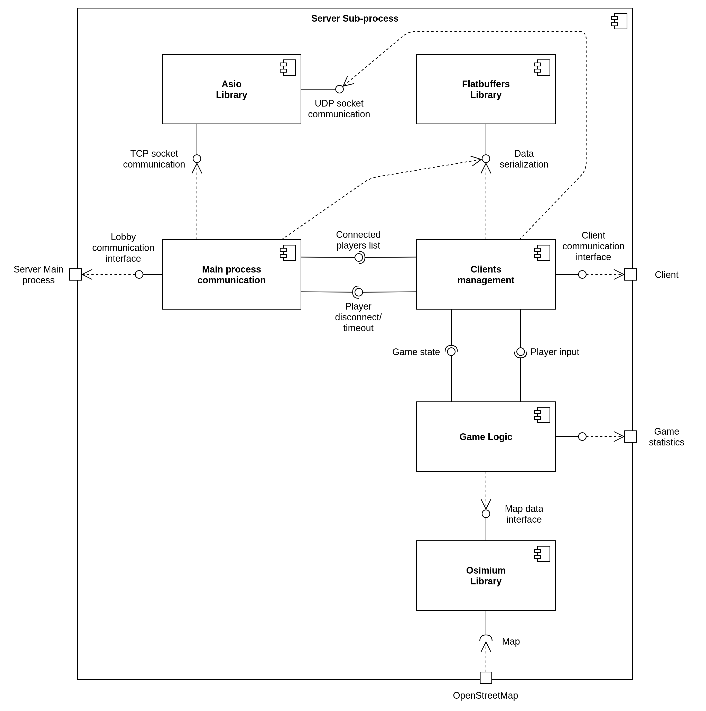
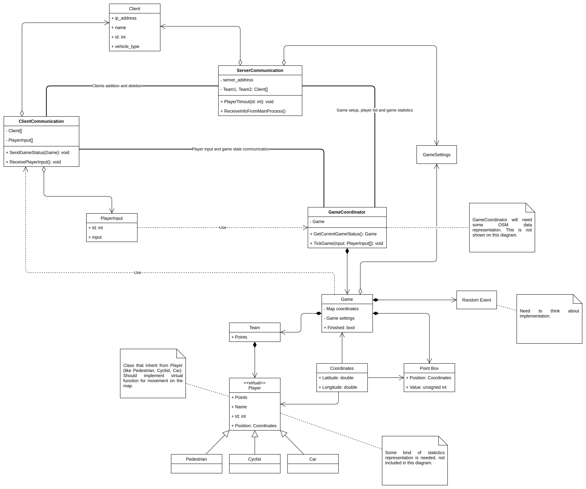
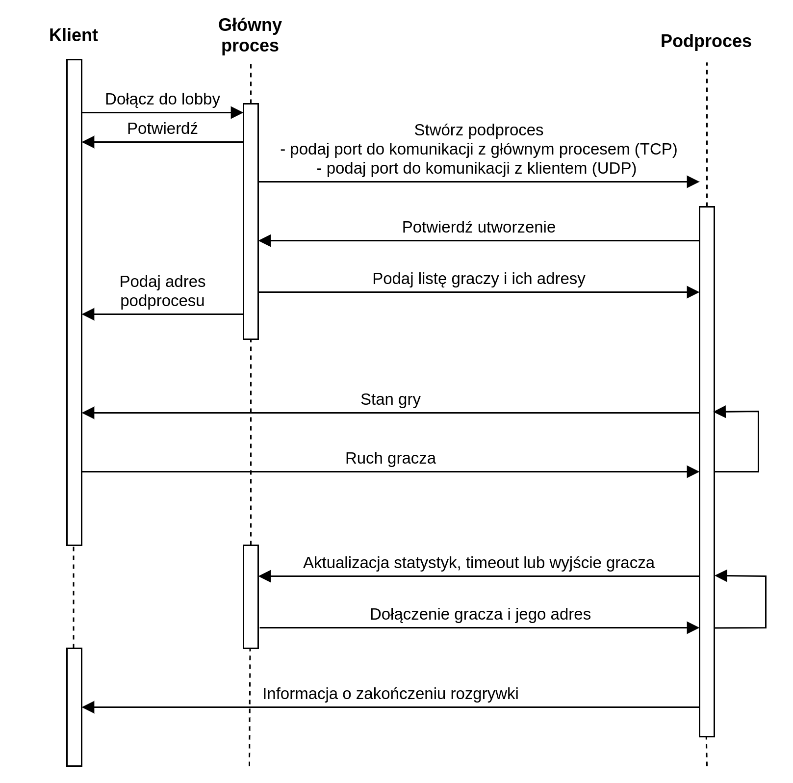

# Podproces 

* [Komponenty podprocesu](#komponenty-podprocesu)
* [Diagram klas](#diagram-klas)
* [Diagram przepływu](#diagram-przepływu)

## Komponenty podprocesu

* #### Komunikacja z głównym procesem backendu
Odpowiada ze przyjmowanie i wysyłanie informacji o klientach i grze między głównym procesem i podprocesem backendu. Komunikacja ta odbywa się poprzez protokół TCP.
* #### Komunikacja z klientami 
Tutaj następuje wymiana informacji pomiędzy podprocesem i wieloma klientami danej gry (graczami). Podproces otrzymuje od klientów ich aktualny input w grze, a wysyła im aktualny status gry, wraz z pozycjami wszystkich graczy. Komunikacja ta odbywa się poprzez protokół UDP.
* #### Logika gry
Odpowiada za obliczanie ruchu graczy, zbierania punktów itp..

Każda z tych części działa na osobnym wątku programu. Zależności między tymi komponentami, oraz zależności od innych bibliotek są przedstawione w diagramie komponentów:

## Diagram klas

## Diagram przepływu

Diagram przepływu danych pomiędzy podprocesem, serwerem głównym i klientem

